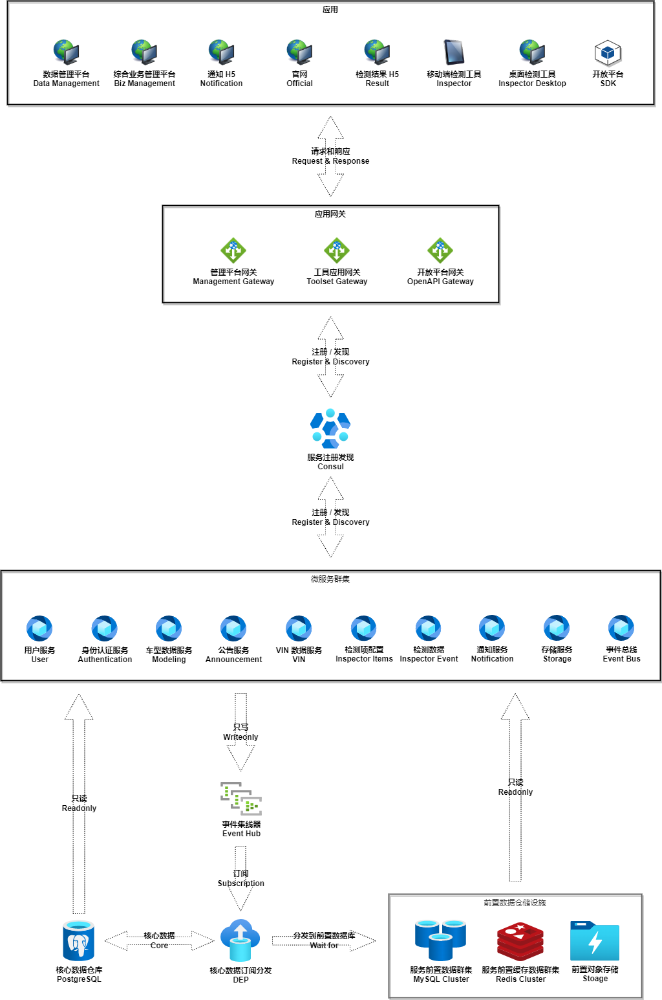

# ADB

*ADB: AUTOMOBILE DATABASE. We are committed to providing a relatively complete "vehicle information" data service and applied it to various scenes of real life.For example: second -hand car transactions, automobile finance and other scenarios.*

> *ADB：汽车信息数据服务。我们致力于提供一个相对完善的“车辆信息”数据服务，并将它应用到现实生活的各个场景当中去。比如：二手车的交易、汽车金融等场景。*

----

## 概要介绍 Introduction

- **功能介绍 Features**
  - ***基础数据服务 Basic Data***
    - *车型数据 Auto Modeling Information：AMI*
      - 品牌 Brand
      - 车系 Series
      - 款型 Style
      - 参数配置 Parameter & Configuration
      - 其他 Other
    - *公告数据 Announcement: ANO*
    - *差异化参数配置 Difference Parameter & Configuration: DPC*
    - *VIN（车辆识别代码）车型解析 VIN Resolver: VIN*
  - ***车辆检测评估服务 Inspect & Evaluate: AIE***
    - *检测项配置 Inspect-Item Settings*
      - 全局检测项 Global
      - 公共检测项 Public Scope
      - 私有检测项 Private Scope
    - *通用检测工具 Inspector*
      - 微信小程序检测工具 Inspector on Wechat
      - 移动 APP 检测工具 Inspector on Andorid & iOS
      - PC 检测工具 Inspector on Desktop
      - 基础检测信息说明书 H5 和 PDF
    - *专家辅助支持系统 Experts Assistant*
      - 选款支持 AMI Assistant
        - IM 工具支持：微信、钉钉、公众号等集成
      - 远程检测支持
      - 专家级别评估
  - ***企业高级服务 Enterprise Advanced: AEA***
    - *车型数据订阅 AMI Subscription: EAMI-S*
    - *检测数据订阅 AIE Subscription：EAIE-S*
  - ***信息共享 Information Sharing: AIS***
    - *检测服务寻包 Inspector Discovery（此服务适用于 C 端客户端寻包）*
    - *检测服务包转发 Inspector Dispatch*
  - ***数据分析 Data Analysis: ADA***
- **开发和部署 Development & Deployment**
  - ***开发环境 Development Environment***

    |开发工具 Tools|版本说明 Version|备注 Remark|
    |---------|---------|---------|
    |Microsoft Windows|10 Professional Edition| |
    |Microsoft Visual Studio|2022 Community Edition| |
    |Microsoft .NET|6| |
    |PostgreSQL|13| |
    |MariaDB| | |
    |Git & SourceTree| | |
    |Node.js|16| |
    |Redis on Windows| |[https://github.com/tporadowski/redis](https://github.com/tporadowski/redis)|
    |Minio| | |
    |RabbitMQ| | |
    |EMQTT| | |
    |Consul| | |
    |Microsoft NuGet| | |
    |Microsoft VSCode| | |
    |Microsoft Tye| | |
    |JDK| | |
    |Jenkins CI| | |
    |微信开发者工具| | |

  - ***部署环境 Deployment Environment***
    - Linux
    - Docker
    - Nginx

## 架构设计 Architecture

## 文档 Documentation

- **数据结构说明 Data Schema**
  - **[HTTP 响应数据结构 Response Schema](docs/response-schema.md)**
